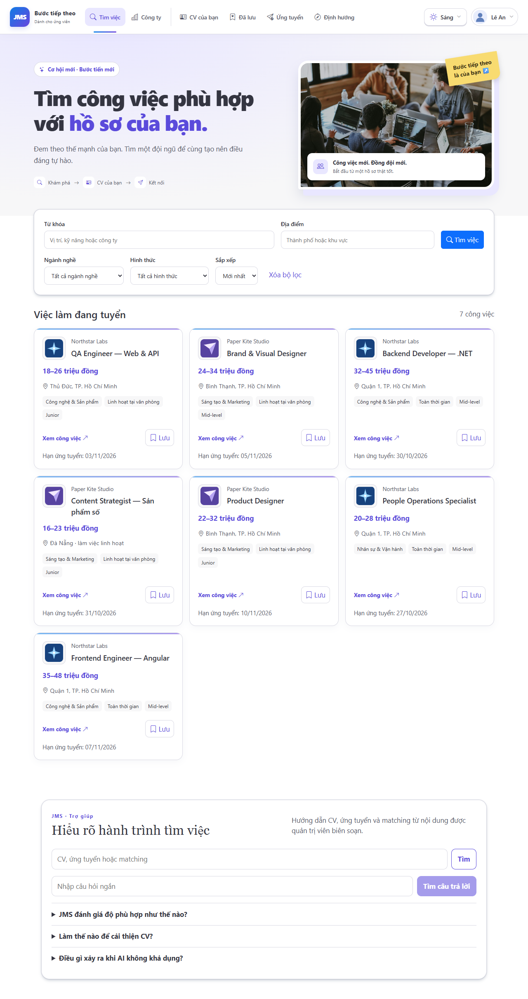
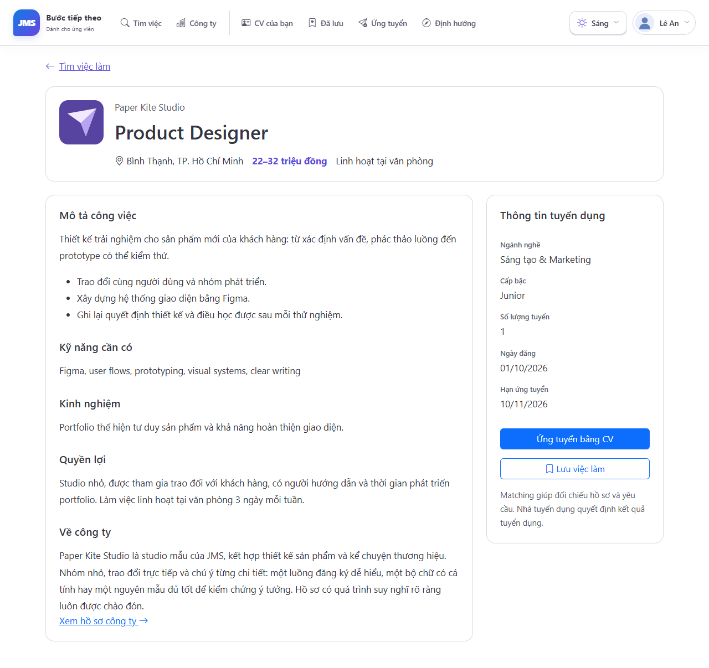
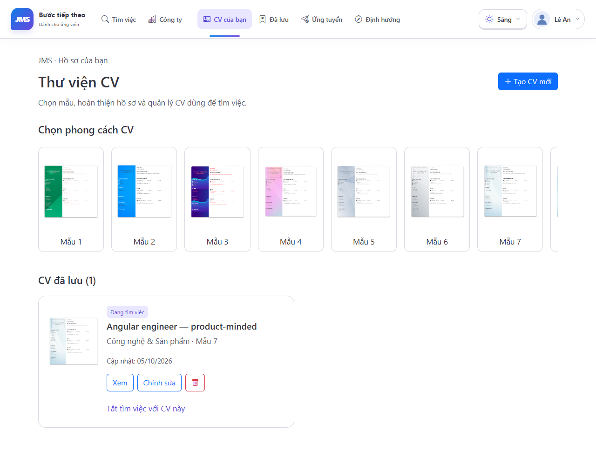
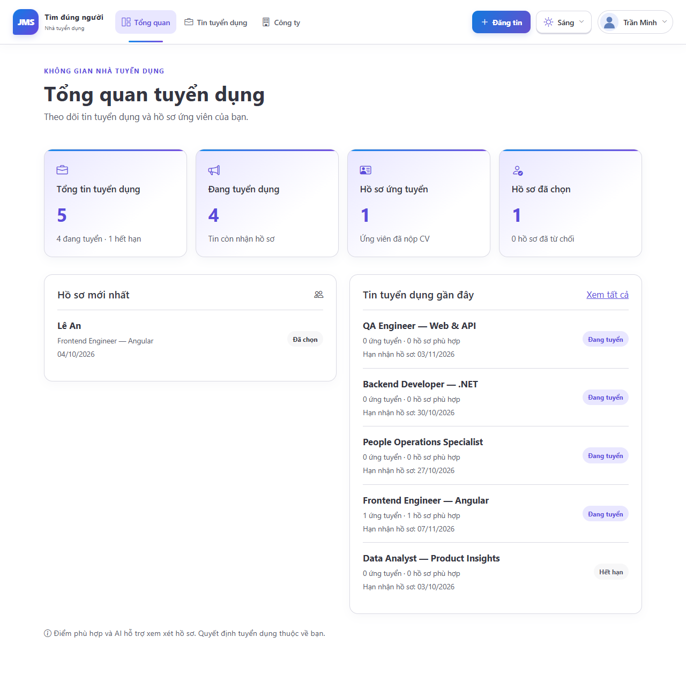
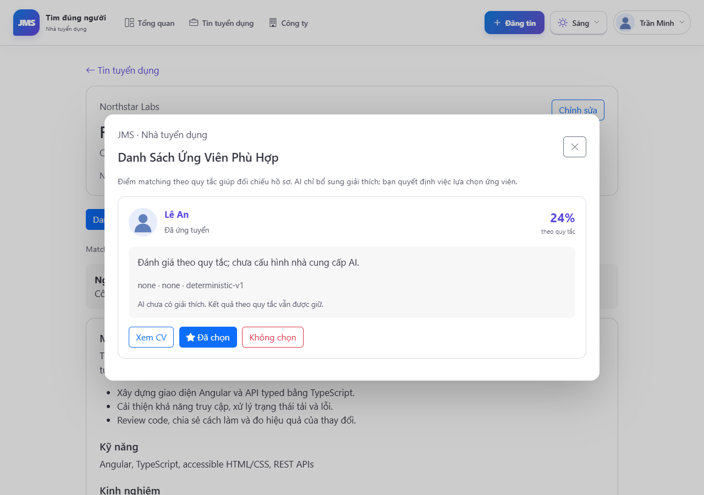
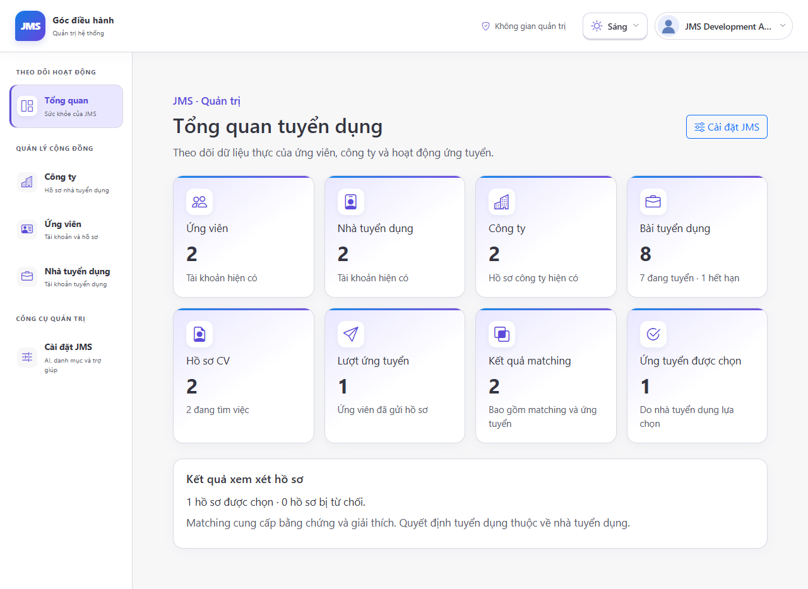

# JMS · 2024 Remaster

A Vietnamese-first recruitment application: candidates build themed CVs, discover and save jobs, apply, and inspect matching evidence; recruiters publish jobs and review candidates; admins manage real JMS data and AI configuration.

This remaster preserves our graduation project's ideas and recognizable blue/purple lineage while finishing workflows, simplifying the frontend, and preparing the application for later hosting. It remains a modest job board.



## Product

- **Candidate:** server-side job search and filters, company profiles, saved jobs, nine original CV themes, CV editing and previews, application history and matching evidence.
- **Recruiter:** real dashboard, searchable active/expired jobs, job and company editing, candidate review, shortlist and rejection actions.
- **Admin:** real recruitment statistics, paged account/company management, protected AI profiles, matching catalogs and curated help.
- **Every role:** coherent sign-in/register flows, grouped navigation with active destinations, account menus, a keyboard-accessible System/Light/Dark dropdown, notifications, accessible confirmations and responsive layouts.

The fictional demo includes two distinct studios, eight job listings across engineering, design, content and operations, two detailed CVs and real rule-based matching snapshots. Workplace photographs are served locally; the blue/purple identity, layered cards and original CV themes give JMS its own character. Motion respects reduced-motion preferences.

**Deterministic matching is authoritative. AI explains evidence and gaps; it does not autonomously decide hiring outcomes.** Gemini, OpenAI and Anthropic use small server-side adapters. Matching still works without an AI key.

## Quick start

Install .NET SDK 10.0.301+, Node.js 24 and npm. Run from the repository root:

```powershell
$env:ASPNETCORE_ENVIRONMENT = 'Development'
dotnet run --project BackEnd/BackEndApplication/APIServer --no-launch-profile --urls http://localhost:8080
```

In another terminal:

```powershell
cd FrontEnd
npm ci
npm start
```

Open `http://localhost:4200`. Use Development for the demo: migrations initialize SQLite and fictional data is added only to an empty database. The default local launch profile already selects Development; when using `--no-launch-profile`, set `$env:ASPNETCORE_ENVIRONMENT='Development'` first.

| Role | Username | Password (local fictional demo only) |
| --- | --- | --- |
| Candidate | `an.le` / `duc.pham` | `JmsDemo!2026` |
| Recruiter | `minh.northstar` / `linh.paperkite` | `JmsDemo!2026` |
| Admin | `demo.admin` | `JmsDemo!2026` |

No AI keys are seeded. In Admin → Cài đặt JMS choose a provider, supported model and its reasoning control, then supply a key. Stored keys are encrypted server-side and never returned to the browser.

## Technology and verification

Angular 21, HttpClient, signals, typed auth forms, Bootstrap 5/Icons and selective CDK; CKEditor for rich text. ASP.NET Core/.NET 10, EF Core, SQLite, JWT and persistent Data Protection. Controllers/services/repositories remain understandable and compatible with historical `Recuirter` contracts.

```powershell
dotnet build BackEnd/BackEndApplication/BackEndApplication.sln
dotnet test BackEnd/BackEndApplication/APIServer.Tests/APIServer.Tests.csproj
cd FrontEnd
npm ci
npm run build -- --configuration prod
npm test
npx playwright test
```

Playwright uses **Microsoft Edge only**, a fresh isolated demo database and the production Angular build. Five signature journeys cover discovery/saved jobs/application, CV editing, recruiter review, rich-text job editing and admin management. One focused navigation check covers keyboard menus, theme choices, all roles and desktop/tablet/mobile layouts. Set `JMS_SCREENSHOTS=1` to refresh the six real application screenshots below.

GitHub Actions verifies backend, frontend, Edge journeys and both Docker build targets. It does not publish images or deploy.

## Hosting preparation

```powershell
$env:JMS_JWT_KEY = '<stable local signing key of at least 32 characters>'
docker compose up --build
```

Compose is a local demo by default. SQLite, Data Protection keys and uploads have separate persistent volumes. Production configuration, CORS origins, the public image origin and frontend API origin are external settings. Production does not seed demo users. The repository contains no provider-specific deployment.

See [development](docs/development.md), [architecture](docs/architecture.md) and [deployment](docs/deployment.md) for configuration, migration, backup and smoke-test details.

## Real seeded application

| Job details | CV library |
| --- | --- |
|  |  |

| Recruiter dashboard | Candidate review |
| --- | --- |
|  |  |



The original CV themes and compatible APIs/schema are retained. Password recovery is deliberately absent until a proper expiring reset-token workflow exists. Help uses curated FAQ content; AI is scoped to matching explanations.
